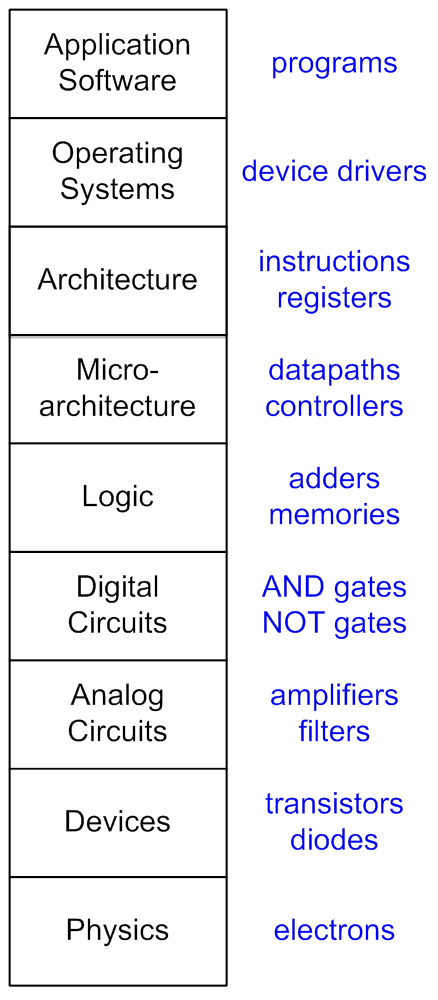

# Intro to Digital Design

## Setup

- Each station has:
  - Cadet trainer
  - Breadboard
  - Wire kit
  - Logic probe
    - Sometimes parting gift for cadets
  - One each of:
    - 7408 (AND)
    - 7432 (OR)
    - XOR
- On board:
  - Basic layout of 74xx chips with question mark gates
- Tech will set up lab for soldering workshop
- Have the box of solder kits in the room
  - Use decision stick kit!
  - Have each cadet take one on the way out
- Have box of 9V batteries available

## Outline

(1 hour for classroom stuff)

- Welcome to EE!
  - What we do
- About me!
  - Ask me questions if you want!
- Around the room
  - Name / hometown
- Analog vs Digital
  - Discrete vs continuous
  - Lose some information
  - Gain:
    - Storage
    - Encryption
    - Digital Logic
- Notion of abstraction

- AND / OR / XOR
  - Truth tables as explanation of behavior
- Mystery chip exercise!
  - You've got three chips that implement these functions
  - Your job is to use the tools you have to figure out which is which
  - Explain where +5V and GND come from
  - Explain how to use logic probe
- Intro to binary / binary math
- Show half adder
  - Using only the gates you've seen so far, you can make a circuit that does addition!
- Show full adder
  - You can cascade these together to add numbers of arbitrary length
  - But it's pretty slow...
- Fun fact! Computers don't subtract
  - They add the negative!
  - So the same circuit we just designed can be used for subtraction
  - If interested, google two's complement
- Tour of Department
  - UAS Lab
  - Power Lab
  - Anechoic Chamber

(1 hour for soldering)
